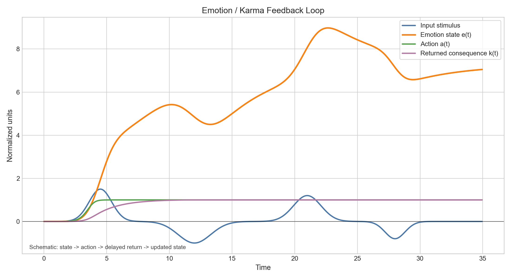
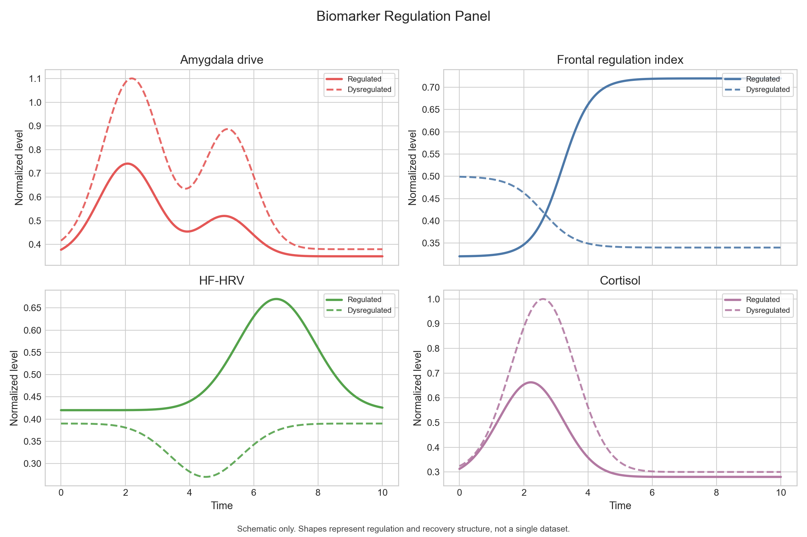
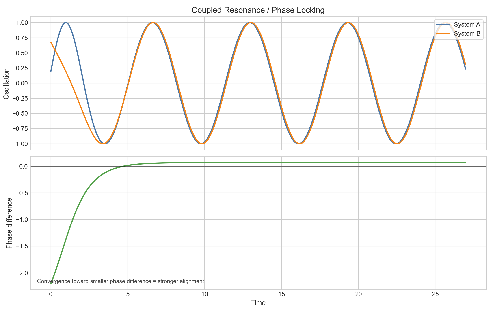
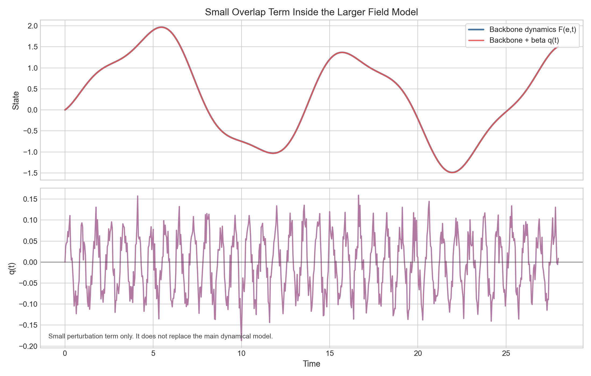
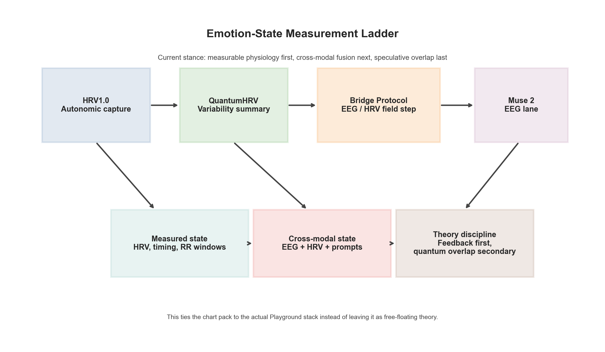
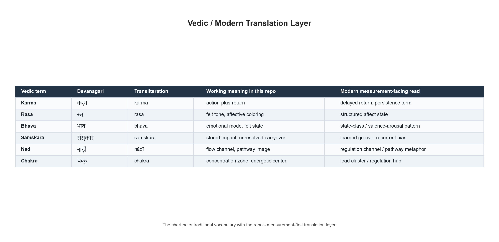
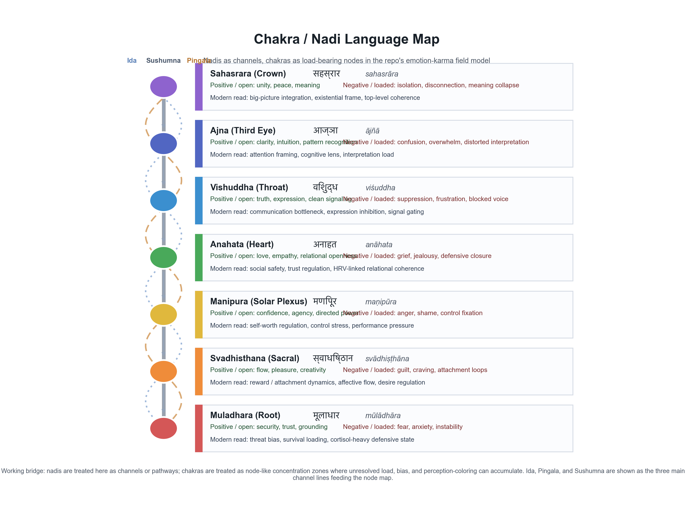
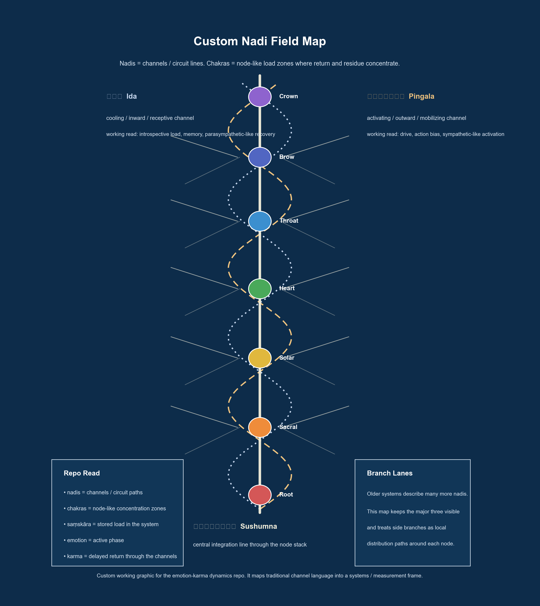

# Emotion Karma Dynamics

This repository holds a measurement-first model for emotional-state dynamics
grounded in signals, feedback loops, and delayed return through time.

The central idea is simple:

- emotion is the active phase of a state
- karma is that same state returning later as residue, consequence, or delayed
  feedback

In this repo, `karma` is used as a modeling term for return, persistence, and
unresolved carryover. The goal is to translate intuitive language about emotion
and consequence into something measurable through physiology, timing, and
state-space dynamics.

The backbone is:

- measurable neural and physiological signals
- nonlinear feedback, delayed return, and resonance across time
- cross-modal measurement through autonomic and cortical channels
- optional quantum-overlap language as a small subscale modulation term within
  the larger field model

## Why This Repo Exists

This project started from a practical question: if emotional events leave
measurable residue, can that residue be modeled the way we model other dynamic
systems with input, lag, feedback, and decay?

That question pushed the work away from abstract commentary and toward a
research frame:

- treat emotional charge as a changing state rather than a vague mood label
- treat consequence as return into that state over time
- look for measurable signatures in HRV, EEG timing, stress-linked regulation,
  and repeated behavioral loops
- keep the model open to traditional language without letting that replace
  observables

The repo is therefore not just a concept sketch. It is a bridge from intuitive
language about emotion, tension, and recurrence into a testable workflow.

## Core Position

The stance in this repo is:

- emotion can be approached as a changing state in a measurable field
- action is output from that state
- consequence returns through the environment and re-enters the state
- this is best modeled first with dynamical systems, control, coupling, and
  delayed feedback
- any quantum-overlap clause belongs as a small modulation term unless the
  observables, state space, and evidence are actually built

Short form:

- `emotion = active state`
- `karma = delayed return into state`

## Working Model

The working model in this repo treats emotion and karma as phased expressions
of the same underlying process:

- `emotion`
  - the immediate state transition
  - the active wave
  - the in-the-moment change in regulation, arousal, and action tendency
- `karma`
  - the delayed phase of that same transition
  - the residue that persists when a state is reinforced, not integrated, or
    repeatedly re-entered
  - the return path by which consequence, memory, physiology, and environment
    feed back into the next state

That does not require mystical language to be useful. It does require a clear
systems frame. In the model used here, `karma` is a structured return signal:
what an event becomes after lag, repetition, and unresolved carryover are added
to the loop.

One practical hypothesis behind the repo is that the first measurable layer of
that return may be physiological:

- HRV disruption or recovery
- stress-linked regulation and cortisol-related shifts
- frontal / limbic regulation patterns
- repeated timing structures in notes, prompts, and behavioral recurrence

## Chemical Ignition And Karma Transition

One working hypothesis in this repo is that the first measurable state of
`karma` may begin as a chemical and autonomic ignition pattern rather than only
as a later story about consequence.

In that read:

- cortisol / norepinephrine-heavy release can mark the start of a threat-loaded
  return state
- dopamine-heavy release can mark the start of anticipation, replay, craving,
  or reinforcement loops
- oxytocin / serotonin-linked regulation can support integration, bonding, or
  stabilization instead of repeated escalation

This can be written as a simple transition model.

Let:

- `c(t)` = chemical release vector
- `e(t)` = active emotion state
- `k_L(t)` = latent karma / unresolved residue
- `k_E(t)` = enacted karma / outward consequence path
- `k_T(t)` = transformed karma / integrated return path
- `R(t)` = regulation / processing / integration input

Then a working form is:

`de/dt = -alpha*e + B*c(t) + gamma*k_L(t) + I(t)`

`dk_L/dt = rho*|e(t)| + eta*||c(t)|| - (mu_E + mu_T)*k_L(t)`

`dk_E/dt = mu_E*k_L(t) - lambda_E*k_E(t)`

`dk_T/dt = mu_T*k_L(t) + beta*R(t) - lambda_T*k_T(t)`

Interpretation:

- the chemical pulse helps ignite the active emotional state
- if the state remains unresolved, load accumulates in `k_L`
- part of that load is enacted into speech, behavior, or repeated outer pattern
- part of that load is transformed through regulation, processing, breathwork,
  time, reframing, or integration

This is the repo's cleanest bridge between intuitive karma language and a
measurement-first model: chemical release -> state activation -> latent load ->
enacted or transformed return.

## Traditional Language, Measurable Translation

The repo also keeps a translation layer between older language and modern
measurement.

In Sanskrit traditions, `karma` is commonly glossed as `action` or `deed`.
Here, that root is carried forward in a systems sense: action plus return,
output plus consequence, state plus re-entry. Likewise, older affective
language around `rasa` and `bhava` is useful here not as proof, but as a clue
that structured emotional categories may be more measurable than they first
appear.

That is part of why this repo stays close to biomarkers and signal structure.
If older emotional categories map to recurrent neural or autonomic patterns,
then the bridge between intuitive language and empirical work becomes much more
practical.

## Vedic / Modern Translation Layer

The README uses a simple working bridge between Vedic language and modern
systems language:

| Vedic / Sanskrit-facing term | Working meaning in this repo | Modern measurement-facing read |
| --- | --- | --- |
| `karma` | action-plus-return, unresolved consequence, delayed re-entry | feedback tail, persistence term, delayed state return |
| `rasa` / `bhava` | felt tone, affective coloring, emotional mode | affective state class, valence/arousal pattern, structured emotional state |
| `saṃskāra` | stored imprint, unresolved carryover, patterned residue | learned groove, persistent bias, recurrent tension / response pattern |
| `nāḍī` / `chakra` language | flow channels and concentration zones in the field description | pathway metaphor, regulation channel, recurrent load or tension zone |

That bridge is part of the point of the repo. Older language supplies a
coherent vocabulary for recurrence, tone, and unresolved carryover; modern
language supplies timing markers, physiology, and signal structure. The model
gets stronger when both are legible in the same frame.

## How We Got Here

The repo emerged from trying to make a vague but persistent intuition more
precise:

- unresolved emotion seems to return rather than disappear
- repeated inner states seem to bias later perception and action
- tension patterns often behave like stored load instead of isolated events
- measurable channels may provide a better handle on that loop than narrative
  description alone

From there, the repo moved toward a cleaner formulation:

- emotion as the immediate wave
- karma as the delayed tail
- recurrence as resonance
- regulation as loop closure

That framing is what ties the concept work in this repo to the broader RFL
stack: HRV capture, EEG overlays, chart generation, and later cross-modal
protocols.

## Repository Layout

- `assets/charts/`
  - chart pack PNGs
- `docs/chart_manifest.md`
  - description of each chart
- `docs/STANCE.md`
  - full modeling stance
- `docs/CITATIONS.md`
  - primary-source citation spine
- `docs/make_emotion_karma_charts.py`
  - chart generator

## Chart Pack

- `01_emotion_feedback_loop.png`
  - state -> action -> delayed return -> updated state
- `02_biomarker_regulation_panel.png`
  - amygdala / frontal regulation / HF-HRV / cortisol
- `03_coupled_resonance.png`
  - phase locking and synchronization
- `04_secondary_modulation.png`
  - small overlap term inside the larger field model
- `05_stack_measurement_ladder.png`
  - ties the stance to the measurement stack and future EEG lane
- `06_vedic_modern_translation_layer.png`
  - Vedic terms, Devanagari, transliteration, and the repo's modern measurement translation
- `07_chakra_language_map.png`
  - seven-chakra language map translated into nodes, channels, emotional polarity, and modern regulation language
- `08_custom_nadi_field_map.png`
  - custom repo-native map of Ida, Pingala, Sushumna, and the chakra nodes as a channel / circuit model

## Diagram Gallery

### Core Dynamics









### Stack And Translation





### Chakra And Nadi Maps





## Stack Tie-In

This repo is designed to tie into the existing stack as follows:

- `renaissancefieldlitehrv1.0`
  - autonomic capture lane
- `QuantumHRV`
  - descriptive variability-summary lane
- `QuantumConsciousnessBridge`
  - protocol / packaging bridge
- future `Muse 2`
  - practical EEG lane for alpha/theta timing, frontal balance, and
    timestamped overlays against HRV and prompt windows

## Rebuild

To regenerate the figures:

```bash
MPLCONFIGDIR=/tmp/mpl python3 docs/make_emotion_karma_charts.py
```
